<h1 align="center">VAINILLA STYLE</h1>
<p align="center">Modded snippets for my personal Obsidian theme.</p>

<p align="center">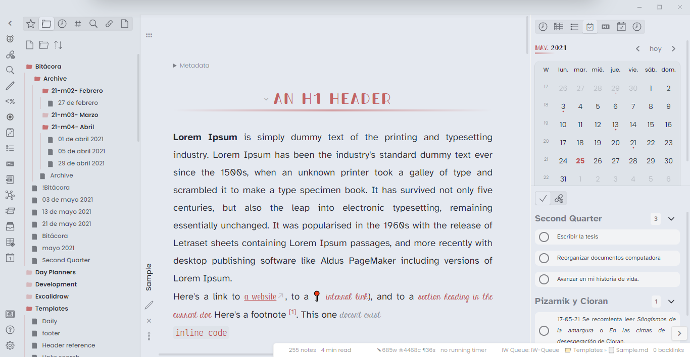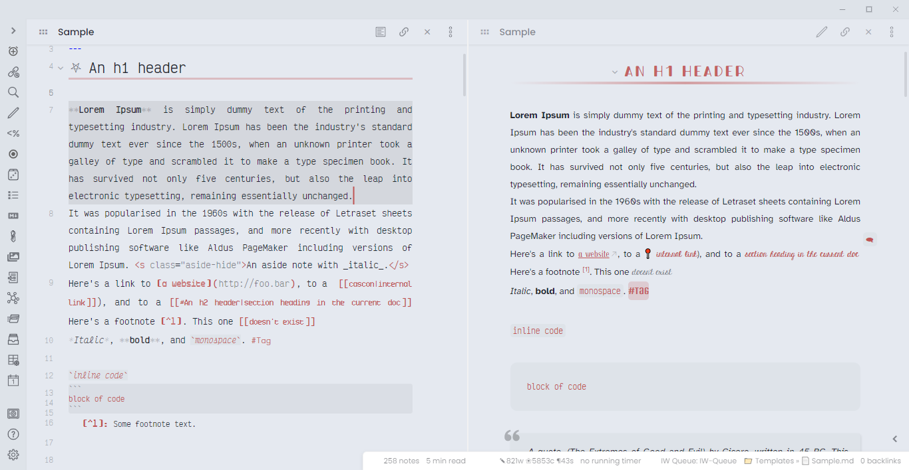</br>
Light mode
</br> </br>
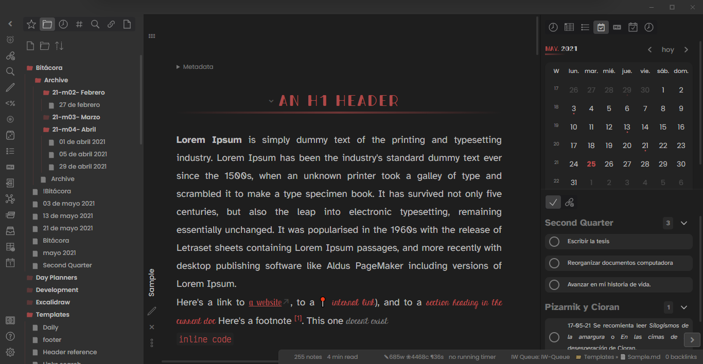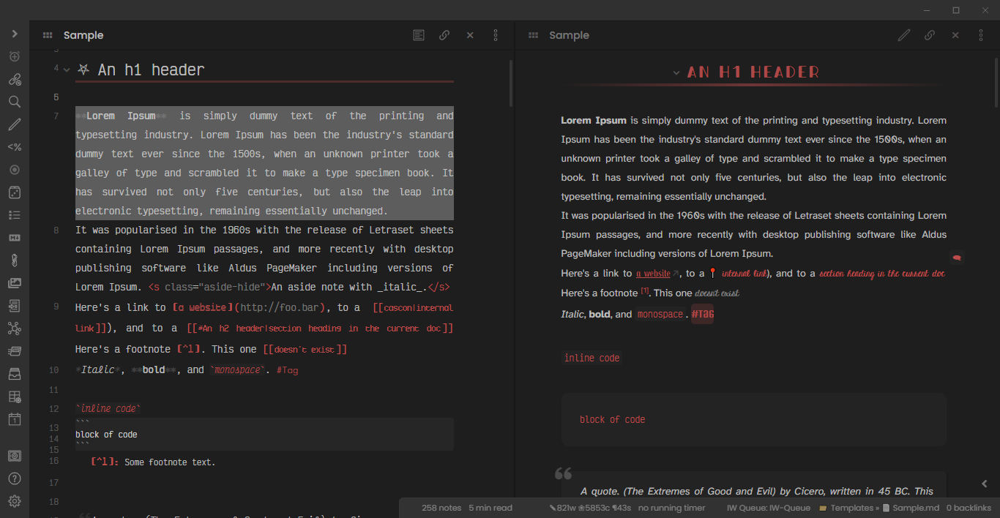 </br> </br>
Dark mode</p>

Newer updates july2021:
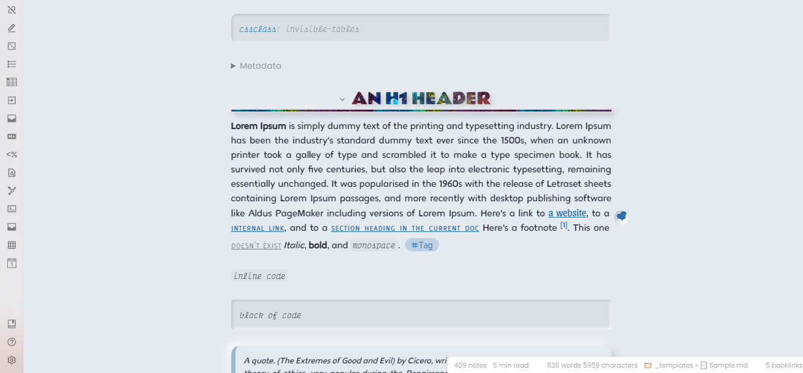
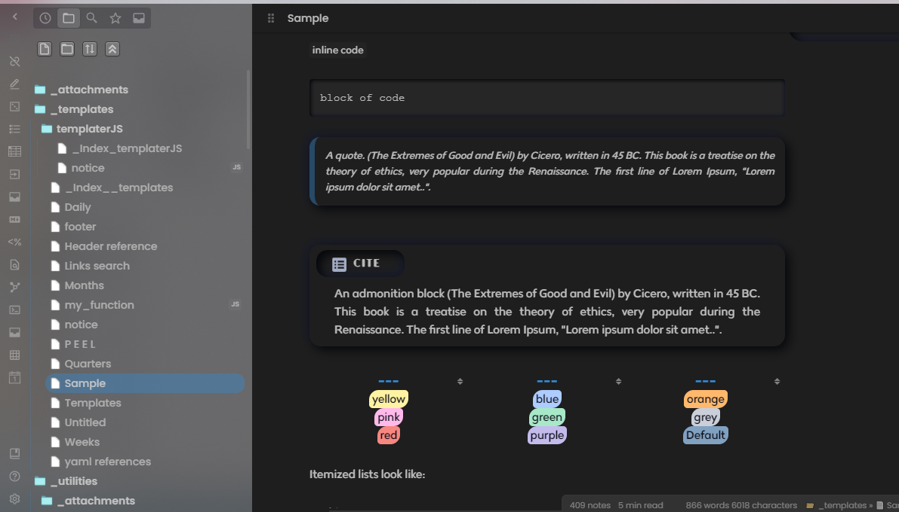


## ABOUT
- All my snippets mods are adjusted so they can work with the [California Coast Theme](https://github.com/mgmeyers/obsidian-california-coast-theme). 
- The same accent color selected for the California Coast Theme is used for the colors of some of the snippets.
- One snippet works using the [Style Settings Plugin](https://github.com/mgmeyers/obsidian-style-settings).
- [Vainille Style Settings (my personal modifications)](#vainilla-style-settings)
- [Vainille Style (Snippets and modifications I used)](#vainilla-style-snippets)
- [Individual Snippets](#snippets)

## [Daily Note](dailyNote/Dailynote.css)
My template for my daily note, with a progress bar.
The html example is [here](dailyNote/Dailynote.md), with a sample and the templater codes.

Adapted from:
    * progress bar --> https://codepen.io/AbdulrahmanMasoud/pen/oNgKoxj
    * typography --> https://codepen.io/kvendrik/pen/nfjas
Tools:
    * neumorphism style --> https://neumorphism.io/ 
    
    
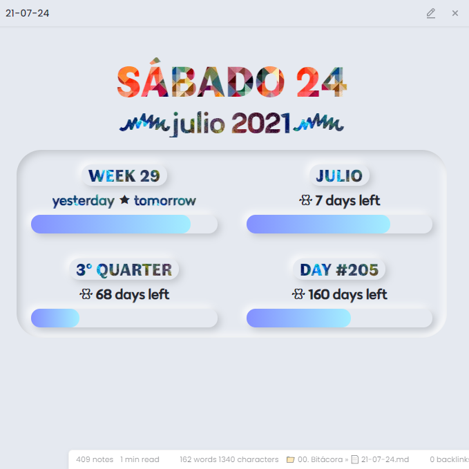


## [Vainilla Style Settings](Snippets/Vainilla_Style_Settings.css)


It works using the [Style Settings Plugin](https://github.com/mgmeyers/obsidian-style-settings).
With it, is posible to define:
- A different font family for the editor.
- Headers (and H6) preview font family
- Change the UI font size.
- General text-align.

### EDITOR settings:
- Choose between the accent, mute and normal color for the markdown rendering color (`**`,`__`, `[[]]`) and footnotes.
- The font-family and font-style for the `[Text in brackets]`, the code font-family, the inline font-style and the code color.

### PREVIEW settings:
- Change the font-family, font-style and font-decoration of internal links, external links, code and tags.

### MERMAID settings:
- Change the mermaid font-family, font-color and node stroke, node stroke width and the fill-color of the nodes.
- Select the mermaid scale.


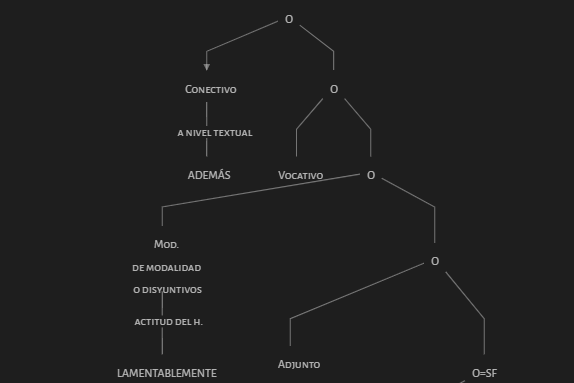    


## [Vainilla Style](Snippets/Vainilla_Style.css) (snippets)
Here is where I made some visual changes.

### Colors
- I changed the background and foreground color, based in the [Material Ocean](https://github.com/material-ocean) color scheme.

```
  :root{
	--color-black-rgb: 15, 17, 26;
	--color-white-rgb: 229,233,240;
}
```

- I added some variables to work with shades of the accent color.
```
.theme-light,
.theme-dark {
    --accent-90: hsla(var(--accent-hsl), 0.9);
    --accent-80: hsla(var(--accent-hsl), 0.8);
    --accent-70: hsla(var(--accent-hsl), 0.7);
    --accent-60: hsla(var(--accent-hsl), 0.6);
    --accent-50: hsla(var(--accent-hsl), 0.5);
    --accent-40: hsla(var(--accent-hsl), 0.4);
    --accent-30: hsla(var(--accent-hsl), 0.3);
    --accent-20: hsla(var(--accent-hsl), 0.2);
    --accent-10: hsla(var(--accent-hsl), 0.1);
    --accent-5: hsla(var(--accent-hsl), 0.05);
    --accent-3: hsla(var(--accent-hsl), 0.03);
    --accent-2: hsla(var(--accent-hsl), 0.02);
}
```

### Nav&Tag pane
It's a mod from [ITS-Theme](https://github.com/SlRvb/Obsidian--ITS-Theme).
Tags have a bullet style only in preview mode. It doesn't affect the tag pane.

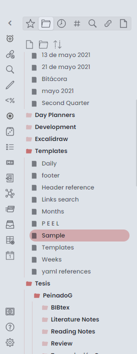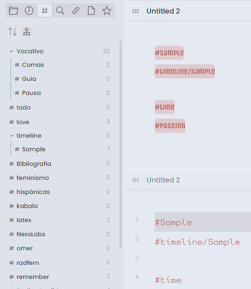


### Header and horizontal lines
Centered, background image for the h1, I also added lines after each of the headings:
 

My previous style, Based on the horizontal gradient line in Preview [source](https://github.com/Dmitriy-Shulha/obsidian-css-snippets/blob/master/Snippets/Lines%20-%20horizontal.md):
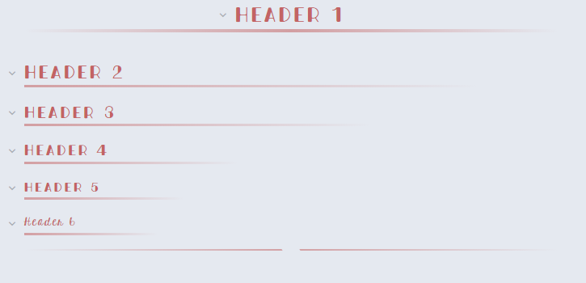 

### Quotes and Code blocks
I changed the quote style and code blocks

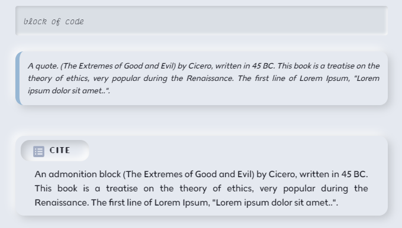

My previous style:
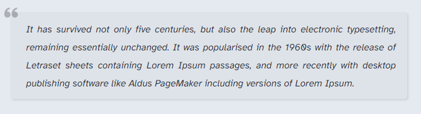


## Snippets
### [Admonition plus](Snippets/Admonition_plus.css)

I modified the title style and the shadow of the admonitions. The rest of the code is from [Admonition-extras](https://github.com/chetachiezikeuzor/Obsidian-Snippets/blob/main/Admonition%20Extras.css).

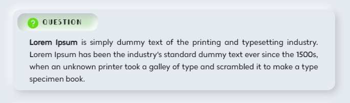

My previous style:

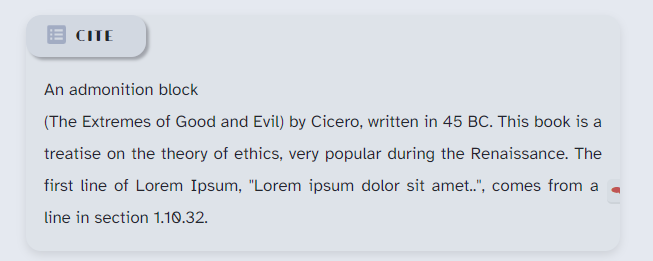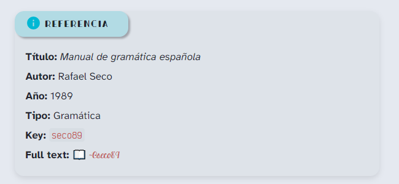

### [Aside blocks](Snippets/Aside.css)
I modified the [ITS-Theme](https://github.com/SlRvb/Obsidian--ITS-Theme) snippet. I changed the shadow style and the italic of the hiden note.
This are an aside note and an inline aside note:

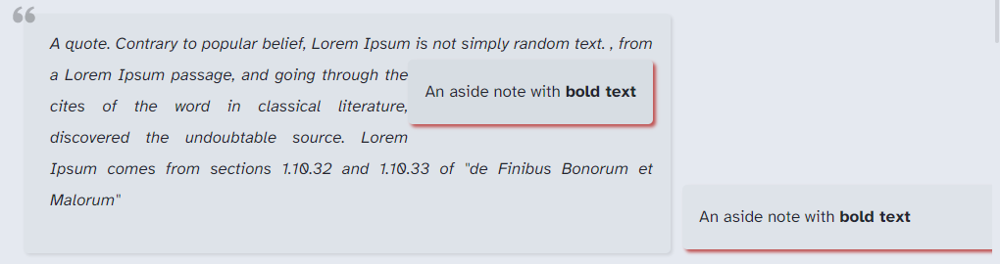

The aside hidden note shows when the bubble is hovered:

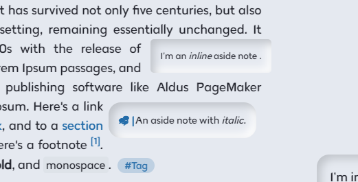


My previous style:
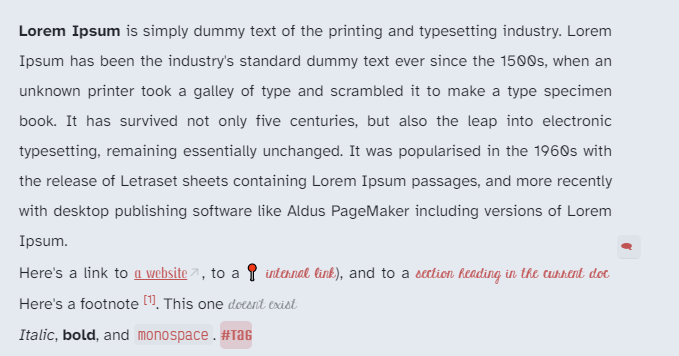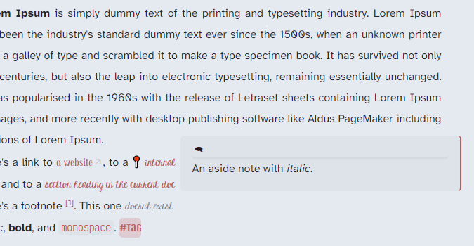


### [Bigger Preview](/Snippets/Bigger_preview.css)
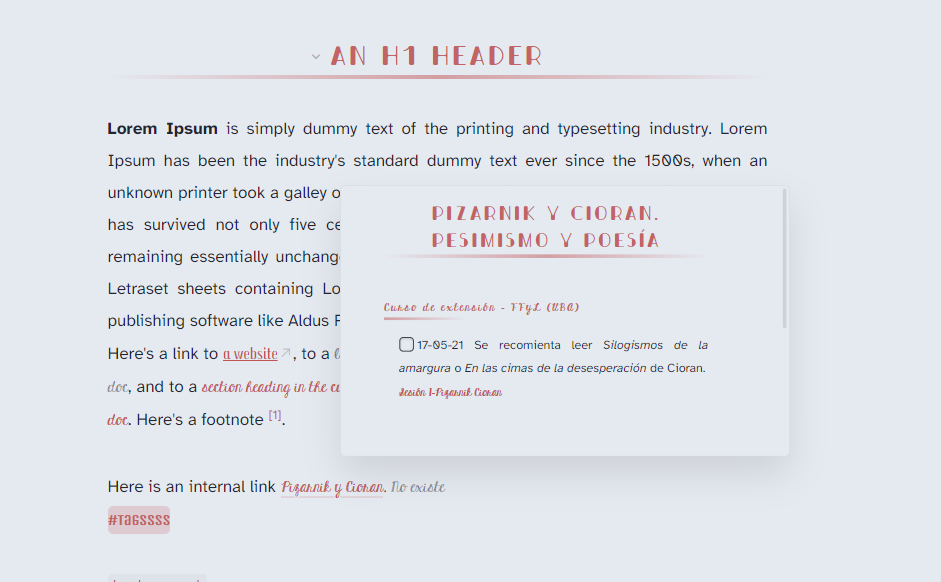

It isn't modified. [Source](https://github.com/chetachiezikeuzor/Obsidian-Snippets#Bigger-Popovers).
  
### [Bullet Point Relationship Lines](Snippets/Bulletpoint.css)

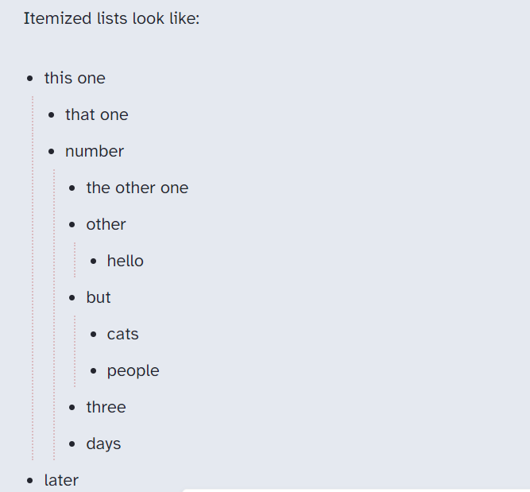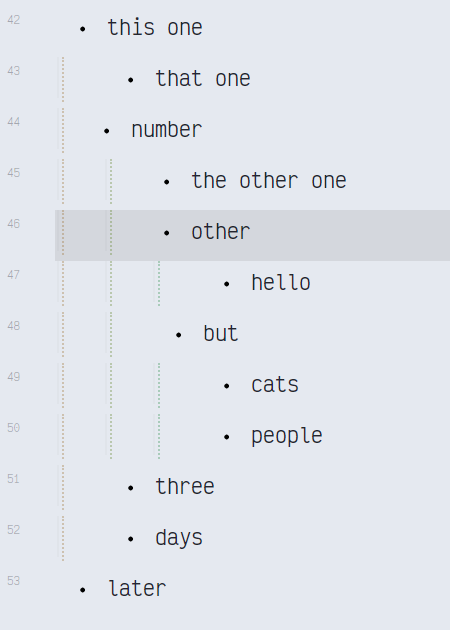


I modified it so the starting color is the accent one. Also, I changed the line decoration into a dotted one. Original snippet: [Point relationship lines - rainbow colors](https://forum.obsidian.md/t/meta-post-common-css-hacks/1978/334)
 
### [Checklist](Snippets/Checklist.css)

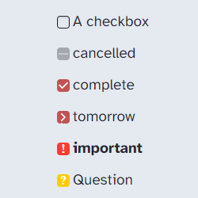


This is the [source](https://github.com/deathau/obsidian-snippets/blob/main/checkbox.css). I just changed some colors. 

### [Image flags](Snippets/Image_Flags_Lithou.css)

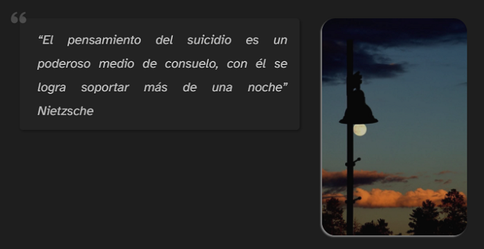

- Image Flags Snippet by [Lithou](http://github.com/lithou/sandbox)
- Almost no modifications.

### [Inline block embeds](Snippets/Inline_block_embed.css)

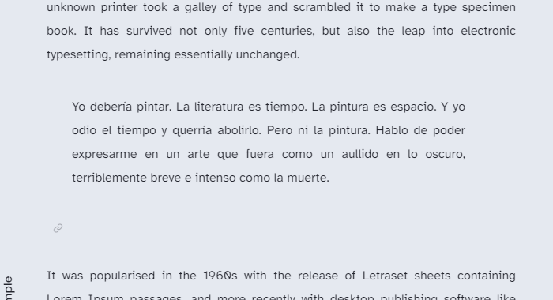

It isn't modified. From [here](https://github.com/deathau/obsidian-snippets/blob/main/inline-block-embeds.css)  

### [Orgsidian](Snippets/orgsidian.css)

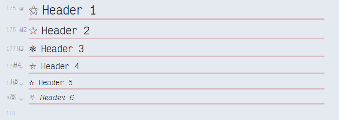

I changed some of the bullets of the [Org-sidian bullets](https://github.com/santiyounger/Org-sidian-Bullets).

### [Pretty highlights](Snippets/Pretty_highlights.css)

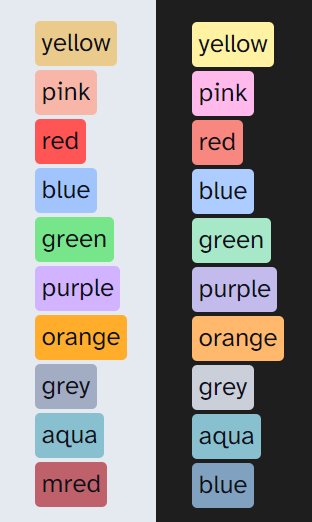 

- Original snippet [here](https://github.com/chetachiezikeuzor/Obsidian-Snippets#Pretty-Highlights).
- I added another mark class, the aqua one. I added some colors based Material Ocean palette. [Here are some samples](Screenshots/Highlight-samples) of how almost all the color options look.
- Then, I added some color codes based on pastel highlighters.

### [Stylized buttons](Snippets/Stylized_buttons.css)

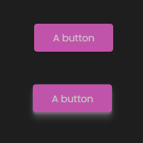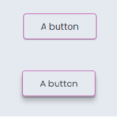


This snippet complements the native style settings of the buton plugin. [Source](https://github.com/Dmitriy-Shulha/obsidian-css-snippets/blob/master/Snippets/Buttons%20-%20stylized.md)

### [Tables](Snippets/Tables.css)

This is how default tables look:

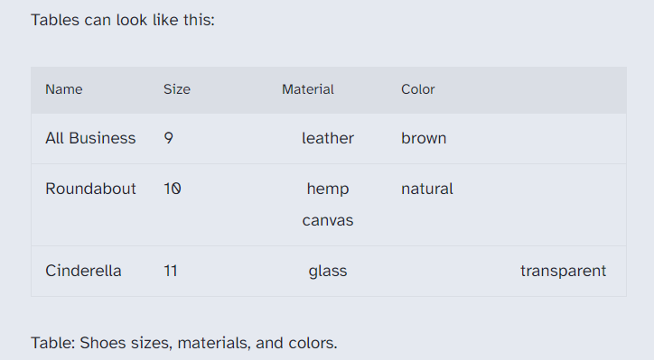

This is the [Tables invisibile cssclass](https://github.com/PurpleGuitar/obsidian-snippets/blob/main/tables-invisible-cssclass.css) snippet. 
Adding `cssclass: invisible` to the YAML, it looks this way:

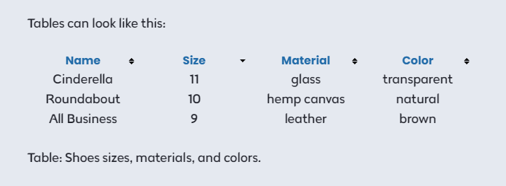

I modified the [Tables that look like latex tables](https://forum.obsidian.md/t/obsidian-tables-that-look-like-latex-tables-with-css/16683) snippet so it matches with the accent colors. 
The YAML must contain: ```cssclass: academia```: 

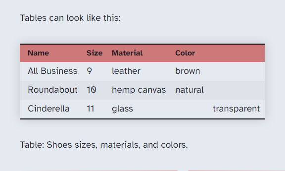

### [VIM MODE](Snippets/Vim-line.css)

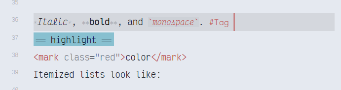

Vim mode with line focus. [Source](https://forum.obsidian.md/t/meta-post-common-css-hacks/1978/17) No mod.


## My fonts 
  - UI font: Poppins Latin
  - Body Font: Atkinson Hyperlegible
  - Body font features: Niramit
  - Monospace font: Victor Mono
  - Headers: Bondi
  - Editor font: Victor Mono
  - \[In brackets font]: Ticketing
  - Tag font: Unica One
  - Internal links: KG Hard Candy Striped
  - External links: Trochut
  - Mermaid font: Alegreya Sans SC

