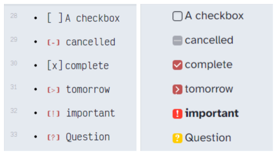

# Vainilla-theme
My modified snippets for my Obsidian theme.

## Using
### Theme and some settings
  - [California Coast Theme](https://github.com/mgmeyers/obsidian-california-coast-theme)
#### Fonts:
  - UI font: Poppins Latin
  - Body Font: Atkinson Hyperlegible
  - body font features: Niramit
  - Monospace font: Victor Mono

### Plugin for Misc-Kustom snippet settings
  - [Style Settings Plugin](https://github.com/mgmeyers/obsidian-style-settings)
####  Kustom fonts
  - Headers: Bondi
  - Editor font: Victor Mono
  - \[In brackets font]: Ticketing
  - Tag font: Unica One
  - Internal links: KG Hard Candy Striped
  - External links: Trochut
  - Mermaid font: Alegreya Sans SC

## Snippets
##### Pretty highlights

[Source](https://github.com/chetachiezikeuzor/Obsidian-Snippets#Pretty-Highlights)

##### Image flags

Image Flags Snippet by [Lithou](http://github.com/lithou/sandbox)

##### Inline block embeds
[Inline block embeds](https://github.com/deathau/obsidian-snippets/blob/main/inline-block-embeds.css)  

##### Aside blocks
  modded from [ITS-Theme](https://github.com/SlRvb/Obsidian--ITS-Theme)
  
##### Checklist and buttons
  
  [Checkbox](https://github.com/deathau/obsidian-snippets/blob/main/checkbox.css)
  
  [Point relationship lines - rainbow colors](https://forum.obsidian.md/t/meta-post-common-css-hacks/1978/334)


Org-sidian bullets headings. [Source](https://github.com/santiyounger/Org-sidian-Bullets)
Vim mode with line focus [Source](https://forum.obsidian.md/t/meta-post-common-css-hacks/1978/17)
[Buttons - stylized](https://github.com/Dmitriy-Shulha/obsidian-css-snippets/blob/master/Snippets/Buttons%20-%20stylized.md)

##### Cute Style

  - Base color from California Coast changed:
```
  :root{
	--color-black-rgb: 15, 17, 26;
	--color-white-rgb: 229,233,240;
}
```


  
  #### Nav&tag pane
  mod from [ITS-Theme](https://github.com/SlRvb/Obsidian--ITS-Theme)
  #### Bigger preview
  [Source](https://github.com/chetachiezikeuzor/Obsidian-Snippets#Bigger-Popovers)
  #### Line gradient
 Horizontal gradient line in Preview [source](https://github.com/Dmitriy-Shulha/obsidian-css-snippets/blob/master/Snippets/Lines%20-%20horizontal.md)
  
##### Kustom
text justification [source](https://github.com/Dmitriy-Shulha/obsidian-css-snippets/blob/master/Snippets/Hyphenation-Justification.md)

##### Tables
[Tables that look like latex tables](https://forum.obsidian.md/t/obsidian-tables-that-look-like-latex-tables-with-css/16683)
[Tables invisibile cssclass](https://github.com/PurpleGuitar/obsidian-snippets/blob/main/tables-invisible-cssclass.css)


##### Admonition
[Admonition-extras](https://github.com/chetachiezikeuzor/Obsidian-Snippets/blob/main/Admonition%20Extras.css)


